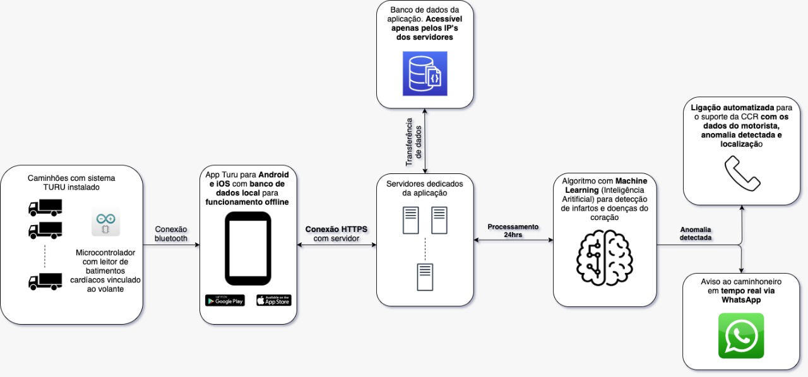
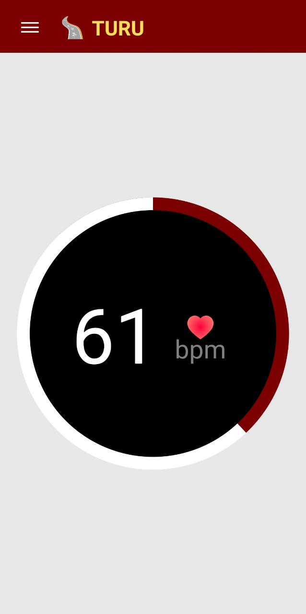

# Turu App!

O Turu app é uma solução de baixo custo para captação dos batimentos cardíacos de motoristas de caminhão e, com ele você nao precisa de wearables, apenas dos items listados abaixo

Neste repositório você encontrará todos os códigos desenvolvidos para o funcionamento do **Turu App**. O projeto é dividido em 3 partes, sendo elas:

 1. **Hardware**
 2. **Server**
 3. **App**  

A arquitetura geral do sistema, pode ser entendida através desta imagem:


# Hardware

Materiais:

 - 1 Arduino Duomilanove
 - 1 Sensor da batimentos Cardíacos
 - 1 Shield Bluetooth

O sensor de batimentos cardiacos tem 3 conexões, o Vcc (colocar no 5v), o negativo (colocar no GND) e 1 sinal (analógico, colocar no A0)
O shield Bluetooth deve ser colodo no TX e RX correspondente, o Vcc em 5v e GND em GND

O software .ino para embarcar está na pasta Hardware

# Server

Para o servidor, utilizamos a linguagem **Javascript**, com o framework **NodeJS**. O servidor é responsável por receber os dados de cada caminhoneiro que são enviados pelo app.

Foi utilizado o Twillio para envar mensages para o whatsapp e o TotalVoice para fazer ligações e foi hospedamos o BE na AWS para os testes (utilizamos o Elastic Beanstalk)

Para rodar o backend:

 - `npm i ` 
 - `npm start`

Criar um arquivo .env com as seguintes variáveis:

````
PORT=<port>
NODE_ENV=local

TWILIO_ACCOUNT_SID=<sid>
TWILIO_AUTH_TOKEN=<token>
TWILIO_WHATSAPP_SENDER=<sender>

TOTAL_VOICE_ACCESS_TOKEN=<token>
````
## APP

  

O aplicativo foi desenvolvido em React Native para mobilidade entra os sistemas operacionais iOS e Android

para executar o app:

 - `npm i` 
 - `cd ios && pod install` 
 - `react-native run-ios` 
 - `react-native   run-android`

Com o app rodando, emparelhar com o bluetooh do Arduino

